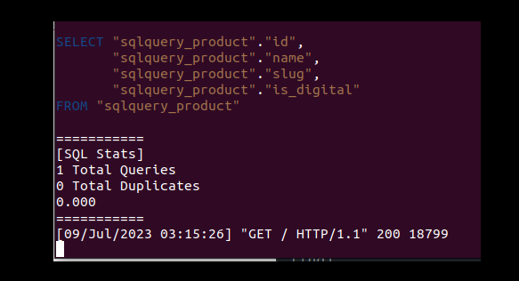

# dg-sqltrace

> A Django middleware package that helps inspect and trace SQL query executions in your terminal. - Used to easily debug a bunch of intertwined SQL queries in your terminal.




### Why?

I started developing this tool in response to a challenge I encountered while working on a pre-existing Django application. Upon joining the project, I discovered numerous bugs in the SQL queries, and its logic was convoluted, which made debugging quite a difficult task. I had to map out all the SQL relationships to be able to move on with the application development irrespective of its intertwined logic. During that period, I longed for a solution that would systematically trace and examine every executed SQL query within the application for the purpose of debugging. That's why I embarked on building this tool.


### Features

- Trace SQL queries
- Inspect and check traces for repeated queries


### Dependencies and Installs

- Python3
  - Install Python3 for [linux/mac/windows](https://www.python.org/downloads)

- Pip & Venv
   - Setup pip and venv [here](https://packaging.python.org/en/latest/guides/installing-using-pip-and-virtual-environments/)


### Install package in an existing Django application

1. Pip install `dg-sqltrace` in your application directory

   ```bash
   pip install dg-sqltrace
   ```
2. Navigate to your `settings.py` file and at the top add this line:

   ```bash
   from dg-sqltrace import middleware
   ```

3. Next move down in your settings.py file to your `MIDDLEWARE` array and add `middleware` to one of the array elements like this:

   ```bash
   ... ,
   ... ,
   middleware
   ```
4. Re-run your server

5. Check your terminal and you should be good to go to inspect all executed SQL queries in your application.


### Setting up the project for contributions and experimentation.

1. Fork repository

2. Clone the forked repository in prefered directory

   ```bash
   git clone <project-url>
   ```

3. Enter project directory
  
   ```bash
   cd dg-sqltrace
   ```

4. Create a virtual enviroment

   ```bash
   python3 -m venv env
   ```

5. Activate virtual environment 

   ```bash
   source env/bin/activate
   ```

6. Install dependencies

   ```bash
   pip install -r requirements.txt
   ```

7. Run

    ```bash
    python3 manage.py runserver
    ```

8. Visit localhost:8000/

   This step automatically populate an SQLite database, query and inspect 1 query by default in your terminal.


### Contributing

if you will like to make a contribution or suggest anything to the project,will be happy to hear from you in issues or PRs section :)    

